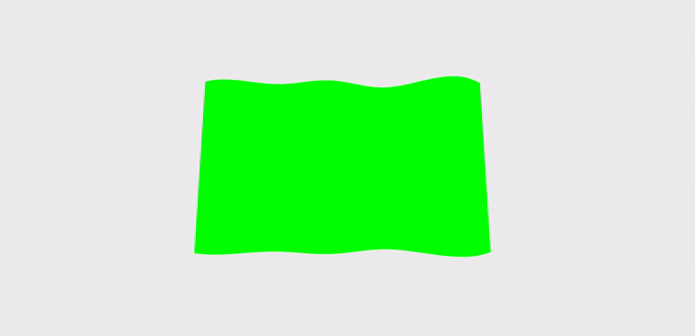
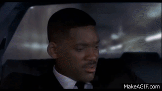
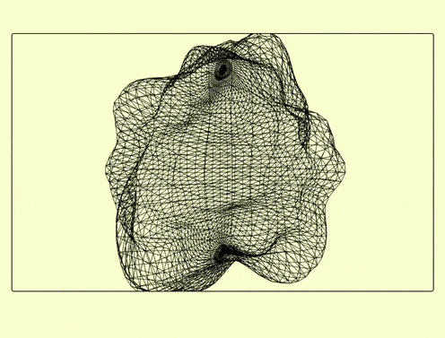

# 🌈

# TESTING DIFFERENT STUFF

### I will try to add a ground animation using Math.sin and then see if I can add multiple models from a single blender model using cannon.

<br>
<br>

##### Yesterday I found an animation That i wanted to adapt to react, I thought it would be easy but it wasnt, perhaps I was too tired, but at the end I could make it work.

- THE ORIGINAL ANIMATION :
  [Three.JS dynamic blob with Perlin noise](https://codepen.io/farisk/pen/vrbzwL?editors=0110)

# 🐖

#### Positive outcomes:

- I discovered a new way to make waves
- I discovered how to make noise using a library I didnt know, called "Perlin".

##### The complication and the errors were mostly related to a bad import or just a bad type.

> Typical errrors:

- Perlin Undefined (Noise undefined)
- Geometry undefined
- Vertices undefined
  <br>

### Due to the issues I encountered 🌵

- It came to my mind that maybe the code of the flag [FLAG project](https://github.com/nadiamariduena/3dflag-threejs-react) could make it. When **When checking the flag code I realize** that I didnt need the whole code but just the **Math.sin**, but of course it gave me an other outcome :), you will it see later.

```javascript
    const clock = new THREE.Clock();

    function animate() {
      // for each time it animates, i want to get a progress of the clock
      const t_timeClock = clock.getElapsedTime();


      cube.geometry.vertices.map((dots_vertices) => {
        //
        //
        const waveX1 = 0.1 * Math.sin(dots_vertices.x * 2 + t_timeClock);

        const waveX2 = 0.15 * Math.sin(dots_vertices.x * 3 + t_timeClock * 2);

        dots_vertices.z = waveX1 + waveX2;
      });

      //
      // // its going to wave the flag smoothly
      cube.geometry.verticesNeedUpdate = true;
```

[]()

<br>
<br>
<hr>
<br>
<br>

## LETS START 🍰

- Read Perlin Documentation:

[Perlin | phaser3-rex](https://rexrainbow.github.io/phaser3-rex-notes/docs/site/perlin/)

#### 0) Install it

```javascript
npm i phaser3-rex-plugins
```

<br>

#### 1) Import Perlin

```javascript
import React, { Component } from "react";
import * as THREE from "three";
import { OrbitControls } from "three/examples/jsm/controls/OrbitControls";
//
//                      ***  PERLIN  ***
import Perlin from "phaser3-rex-plugins/plugins/perlin.js";
```

<br>
<br>

#### 2) Add it inside the Objects Function

- **Init** it

<!-- []() -->

```javascript
// https://rexrainbow.github.io/phaser3-rex-notes/docs/site/perlin/
this.noise = new Perlin();
//
```

<br>
<br>

#### 3) Set up the Geometry you want to work with:

```javascript
//  Related to the image inside the material of the geomatry
const loader = new THREE.TextureLoader();
//
//
//
this.geometry = new THREE.SphereGeometry(50, 50, 50, 50);
this.material = new THREE.MeshLambertMaterial({
  color: 0xdddddd,
  wireframe: true,
  // map: loader.load("NataliaSamoilova_metalmagazine-10.jpg"),
});

this.cube = new THREE.Mesh(this.geometry, this.material);
this.scene.add(this.cube);
//
// Optional ***
this.cube.rotation.set(-0.1, 0, 0);
```

<br>

#### 3) ANIMATE the Geometry

- THE ORIGINAL ANIMATION :
  [Three.JS dynamic blob with Perlin noise](https://codepen.io/farisk/pen/vrbzwL?editors=0110)

```javascript
// change '0.003' for more aggressive animation
// 01 is very slow, 03 faster, 05 extremely faster
this.animationSpeed = performance.now() * 0.001;
//

//--------------------------------
//      The waves/pikes
// -------------------------------
// 2 not too much , 5 lots
var spikes = 5;
for (
  var eachVertice = 0;
  eachVertice < this.cube.geometry.vertices.length;
  eachVertice++
) {
  var p = this.cube.geometry.vertices[eachVertice];
  p.normalize().multiplyScalar(
    1 +
      0.3 *
        this.noise.perlin3(
          p.x * spikes + this.animationSpeed,
          p.y * spikes,
          p.z * spikes
        )
  );
}
// noise related you can also use Math.sin instead of the noise but its different
// https://rexrainbow.github.io/phaser3-rex-notes/docs/site/perlin/
this.cube.geometry.computeVertexNormals();
this.cube.geometry.normalsNeedUpdate = true;
this.cube.geometry.verticesNeedUpdate = true;
//
```

<br>

[]()

- VIDEO SPEED(has nothing to do with the animation) but you can style it like in the img here:

```javascript
// change '0.003' for more aggressive animation
// 01 is very slow, 03 faster, 05 extremely faster
this.animationSpeed = performance.now() * 0.001;
```

#### PLAYING AROUND

[]()
