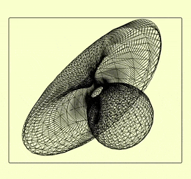
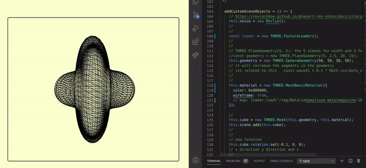
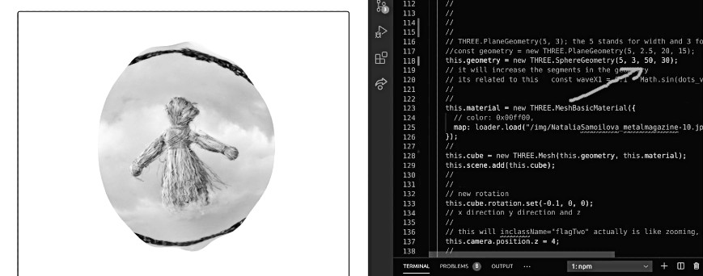

# 🌈

# TESTING DIFFERENT STUFF

<!-- [](https://youtu.be/veT2R19p90k) -->

[]()

### I will try to add a ground animation using Math.sin and then see if I can add multiple models from a single blender model using cannon.

<br>
<br>

##### Yesterday I found an animation That i wanted to adapt to react, I thought it would be easy but it wasnt, perhaps I was too tired, but at the end I could make it work.

- THE ORIGINAL ANIMATION :
  [Three.JS dynamic blob with Perlin noise](https://codepen.io/farisk/pen/vrbzwL?editors=0110)

# 🐖

#### Positive outcomes:

- I discovered a new way to make waves
- I discovered how to make noise using a library I didnt know, called "Perlin".

##### The complication and the errors were mostly related to a bad import or just a bad type.

> Typical errrors:

- Perlin Undefined (Noise undefined)
- Geometry undefined
- Vertices undefined
  <br>

  ### 🔴 (update)

- THE ERROR reason was the three version, I typed npm three and i got this one: "three": "^0.125.2", but if I used the following: "three": "^0.123.0" it works perfectly.

  ```javascript
  //this version:
       "three": "^0.123.0",
       //is the one that will allow you to make this function work:

       for (
      var eachVertice = 0;
      eachVertice < this.cube.geometry.vertices.length;
      eachVertice++
    ) {
      var p = this.cube.geometry.vertices[eachVertice];
      p.normalize().multiplyScalar(
        1 +
          0.3 *
            this.noise.perlin3(
              p.x * spikes + this.animationSpeed,
              p.y * spikes,
              p.z * spikes
            )
      );
    }
  ```

### Due to the issues I encountered 🌵

- It came to my mind that maybe the code of the flag [FLAG project](https://github.com/nadiamariduena/3dflag-threejs-react) could make the job. **When checking the flag code I realize** that I didnt need the whole code but just the **Math.sin**, but of course it gave me an other outcome :), you will it see later.

```javascript
    const clock = new THREE.Clock();

    function animate() {
      // for each time it animates, i want to get a progress of the clock
      const t_timeClock = clock.getElapsedTime();


      cube.geometry.vertices.map((dots_vertices) => {
        //
        //
        const waveX1 = 0.1 * Math.sin(dots_vertices.x * 2 + t_timeClock);

        const waveX2 = 0.15 * Math.sin(dots_vertices.x * 3 + t_timeClock * 2);

        dots_vertices.z = waveX1 + waveX2;
      });

      //
      // // its going to wave the flag smoothly
      cube.geometry.verticesNeedUpdate = true;
```

[]()

<br>
<br>
<hr>
<br>
<br>

## LETS START 🍰

- Read Perlin Documentation:

[Perlin | phaser3-rex](https://rexrainbow.github.io/phaser3-rex-notes/docs/site/perlin/)

#### 0) Install it

```javascript
npm i phaser3-rex-plugins
```

<br>

#### 1) Import Perlin

```javascript
import React, { Component } from "react";
import * as THREE from "three";
import { OrbitControls } from "three/examples/jsm/controls/OrbitControls";
//
//                      ***  PERLIN  ***
import Perlin from "phaser3-rex-plugins/plugins/perlin.js";
```

<br>
<br>

#### 2) Add it inside the Objects Function

- **Init** it

<!-- []() -->

```javascript
// https://rexrainbow.github.io/phaser3-rex-notes/docs/site/perlin/
this.noise = new Perlin();
//
```

<br>
<br>

#### 3) Set up the Geometry you want to work with:

```javascript
//  Related to the image inside the material of the geomatry
const loader = new THREE.TextureLoader();
//
//
//
this.geometry = new THREE.SphereGeometry(50, 50, 50, 50);
this.material = new THREE.MeshLambertMaterial({
  color: 0xdddddd,
  wireframe: true,
  // map: loader.load("NataliaSamoilova_metalmagazine-10.jpg"),
});

this.cube = new THREE.Mesh(this.geometry, this.material);
this.scene.add(this.cube);
//
// Optional ***
this.cube.rotation.set(-0.1, 0, 0);
```

<br>

#### 3) ANIMATE the Geometry

- THE ORIGINAL ANIMATION :
  [Three.JS dynamic blob with Perlin noise](https://codepen.io/farisk/pen/vrbzwL?editors=0110)

```javascript
// change '0.003' for more aggressive animation
// 01 is very slow, 03 faster, 05 extremely faster
this.animationSpeed = performance.now() * 0.001;
//

//--------------------------------
//      The waves/pikes
// -------------------------------
// 2 not too much , 5 lots
var spikes = 5;
for (
  var eachVertice = 0;
  eachVertice < this.cube.geometry.vertices.length;
  eachVertice++
) {
  var p = this.cube.geometry.vertices[eachVertice];
  p.normalize().multiplyScalar(
    1 +
      0.3 *
        this.noise.perlin3(
          p.x * spikes + this.animationSpeed,
          p.y * spikes,
          p.z * spikes
        )
  );
}
// noise related you can also use Math.sin instead of the noise but its different
// https://rexrainbow.github.io/phaser3-rex-notes/docs/site/perlin/
this.cube.geometry.computeVertexNormals();
this.cube.geometry.normalsNeedUpdate = true;
this.cube.geometry.verticesNeedUpdate = true;
//
```

<br>

[]()

- VIDEO SPEED(has nothing to do with the animation) but you can style it like in the img here:

```javascript
// change '0.003' for more aggressive animation
// 01 is very slow, 03 faster, 05 extremely faster
this.animationSpeed = performance.now() * 0.001;
```

<br>
<br>

#### the code for the wireframed Blob

```javascript
addCustomSceneObjects = () => {
  // INIT Perlin:
  this.noise = new Perlin();
  // https://rexrainbow.github.io/phaser3-rex-notes/docs/site/perlin/
  //
  const loader = new THREE.TextureLoader();
  //
  //
  // THREE.PlaneGeometry(5, 3); the 5 stands for width and 3 for height
  //const geometry = new THREE.PlaneGeometry(5, 2.5, 20, 15);
  this.geometry = new THREE.SphereGeometry(50, 50, 50, 50);
  // it will increase the segments in the geometry
  // its related to this   const waveX1 = 0.1 * Math.sin(dots_vertices.x * 2 + t_timeClock);
  //
  //
  this.material = new THREE.MeshBasicMaterial({
    color: 0x000000,
    wireframe: true,
    // map: loader.load("/img/NataliaSamoilova_metalmagazine-10.jpg"),
  });

  //
  this.cube = new THREE.Mesh(this.geometry, this.material);
  this.scene.add(this.cube);
  //
  //
  // new rotation
  this.cube.rotation.set(-0.1, 0, 0);
  // x direction y direction and z
  // this.clock = new THREE.Clock();

  //
};
/*
 
                4
 
 
 */

startAnimationLoop = () => {
  // the original animation
  //codepen.io/farisk/pen/vrbzwL?editors=0010
  // change '0.003' for more aggressive animation
  // 01 is very slow, 03 faster, 05 extremely faster
  this.animationSpeed = performance.now() * 0.001;
  //
  //--------------------------------
  //      The waves
  // -------------------------------
  //
  var spikes = 2;
  for (
    var eachVertice = 0;
    eachVertice < this.cube.geometry.vertices.length;
    eachVertice++
  ) {
    var p = this.cube.geometry.vertices[eachVertice];
    p.normalize().multiplyScalar(
      1 +
        0.3 *
          this.noise.perlin3(
            p.x * spikes + this.animationSpeed,
            p.y * spikes,
            p.z * spikes
          )
    );
  }
  // noise related you can also use Math.sin instead of the noise but its different
  // https://rexrainbow.github.io/phaser3-rex-notes/docs/site/perlin/
  this.cube.geometry.computeVertexNormals();
  this.cube.geometry.normalsNeedUpdate = true;
  this.cube.geometry.verticesNeedUpdate = true;
  //
  //

  this.renderer.render(this.scene, this.camera);
  this.requestID = window.requestAnimationFrame(this.startAnimationLoop);
};
```

<br>

# 👾

### The code:

[CHECK OUT the entire code](src/docs/BLOB_option.md)

<br>
<hr>
<br>
<br>
<br>

### PLAYING AROUND

[]()

[]()

<br>
<br>

## CONCLUSION

- IF I WANTED to add an **atypic pond** to a future scene, I can just use for now one of these options below, of course I can also make it in Blender but it s nice to have more options.

<br>
<br>
<br>

#### THE CODE for the flat animation with vertices noise on the borders

```javascript
  addCustomSceneObjects = () => {
    // https://rexrainbow.github.io/phaser3-rex-notes/docs/site/perlin/
    this.noise = new Perlin();
    //
    //
    const loader = new THREE.TextureLoader();
    //
    //
    // THREE.PlaneGeometry(5, 3); the 5 stands for width and 3 for height
    //const geometry = new THREE.PlaneGeometry(5, 2.5, 20, 15);
    this.geometry = new THREE.PlaneGeometry(50, 50, 50, 50);
    // it will increase the segments in the geometry
    // its related to this   const waveX1 = 0.1 * Math.sin(dots_vertices.x * 2 + t_timeClock);
    //
    //
    this.material = new THREE.MeshBasicMaterial({
      // color: 0xdddddd,
      // wireframe: true,
      map: loader.load("/img/NataliaSamoilova_metalmagazine-10.jpg"),
    });

    //
    this.cube = new THREE.Mesh(this.geometry, this.material);
    this.scene.add(this.cube);
    //
    //
    // new rotation
    this.cube.rotation.set(-0.1, 0, 0);
    // x direction y direction and z

  };


  startAnimationLoop = () => {
    // the original animation
    //codepen.io/farisk/pen/vrbzwL?editors=0010
    // change '0.003' for more aggressive animation
    // 01 is very slow, 03 faster, 05 extremely faster
    this.animationSpeed = performance.now() * 0.001;

    //--------------------------------
    //      The waves
    // -------------------------------
    //
    var spikes = 2;
    for (
      var eachVertice = 0;
      eachVertice < this.cube.geometry.vertices.length;
      eachVertice++
    ) {
      var p = this.cube.geometry.vertices[eachVertice];
      p.normalize().multiplyScalar(
        1 +
          0.3 *
            this.noise.perlin3(
              p.x * spikes + this.animationSpeed,
              p.y * spikes,
              p.z * spikes
            )
      );
    }
    // noise related you can also use Math.sin instead of the noise but its different
    // https://rexrainbow.github.io/phaser3-rex-notes/docs/site/perlin/
    this.cube.geometry.computeVertexNormals();
    this.cube.geometry.normalsNeedUpdate = true;
    this.cube.geometry.verticesNeedUpdate = true;
```

<br>

### The flat sphere with waves

[](https://youtu.be/ZaIXObnzb5o)

```javascript

    this.clock = new THREE.Clock();

    //
  };
  /*

                4


 */

  startAnimationLoop = () => {
    const t_timeClock = this.clock.getElapsedTime();
    //
    // With the vertices we are going to grab all the points /vertices withing the cube/flag
    //
    //
    this.cube.geometry.vertices.map((dots_vertices) => {
      const waveX1 = 0.5 * Math.sin(dots_vertices.x * 2 + t_timeClock);
      // second wave
      const waveX2 = 0.25 * Math.sin(dots_vertices.x * 3 + t_timeClock * 2);
      // 3 wave but in the Y direction
      const waveY1 = 0.1 * Math.sin(dots_vertices.y * 5 + t_timeClock * 0.5); //to slowdown the time t_timeClock * 0.5);
      //
      //
      dots_vertices.z = waveX1 + waveX2 + waveY1;
    });

    //
    // // its going to wave the flag smoothly
    this.cube.geometry.verticesNeedUpdate = true;
    //

    this.renderer.render(this.scene, this.camera);

    this.requestID = window.requestAnimationFrame(this.startAnimationLoop);
  };
```

# 👾

### The code:

[CHECK OUT the entire code](src/docs/WAVYGROUND.md)

<!-- []() -->

[](https://youtu.be/ZaIXObnzb5o)

<br>
<br>

### TO CONTINUE
